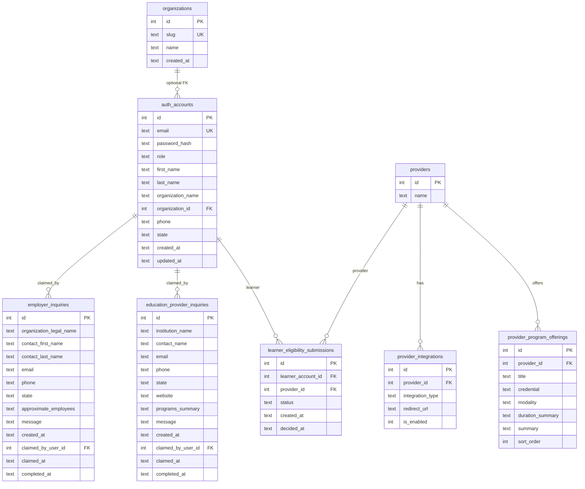

# Project Description

## Task 1

Our website has a contact form, but we realized we were missing some fields.

Please add the following fields so that they are collected from the user and also make sure to include them in the email sent to the marketing team:

- Phone number
- State (US only)
- Company

## Task 2

Our university catalog page shows a list of all the education providers in our system with a link to "Check eligibility"

This link redirects the user to the eligibility form.

As part of a new business initiative we are going to allow education providers to integrate
with us in a way that allows users to directly access their portals rather than using the eligibility form.

Update the university catalog page so if the elected university is in the new integration program, the user is redirected to their portal.

## Finished the task
Once you are done with your changes, you have to create a git bundle and send it back to us.
To create a bundle run from the root of the assessment:
```bash
git bundle create <your-name>.bundle --all
```

Make sure you included all your commits in the `main` branch and updated any instructions on how to start the project.

## FAQ

### I have questions about some of the requirements

If you need more detail in some requirements, you can make assumptions to unblock you from implementing the feature.
But make sure you add documentation on the assumptions you made, feel free to add those in the form of Q&A in the readme.


### Project updates/documentation

- Must run 'yarn dev' in the project's root directory to start both backend and frontend simultaneously

### Project Questions/Assumptions

- I assumed that the goal for this assessment was to mirror many of the functionalities of the Workforce Edge website. After spending considerable time analyzing the workforce edge website,
I quickly realzied that standalone form that was shared in this assessment, covers the functionality for employers and education providers. The eligibility piece is heavily tied to learner functionality.
- I assumed that the console.log that's currenty happening after form submission, should instead be replaced with maybe a mailing service to alert the edgeforce team of a new inquiry that they have to tend to
- 


-------------------------------------------------------------------------------------------------------------------------------------------------------------------------------------------------------------
# Workforce Cliff — Project documentation

This repository is a **full-stack demo** of Workforce Cliff: a React (Vite) client, an Express API, and a **SQLite** database. Use this document for the **entity-relationship model** and **end-user workflows**.

---

## Tech stack

| Layer | Technology |
|--------|------------|
| Client | React 18, TypeScript, Vite, MUI, React Router |
| API | Express 4, TypeScript (`tsx`), JWT bearer auth |
| Data | SQLite (`sqlite` / `sqlite3`), file at `server/db/assessment.db` (created on first run) |
| Shared types | `shared/` (e.g. `Auth.ts`, `tenants.ts`, `Provider.ts`) |

**Local development:** from the repo root, `yarn dev` (or `npm run dev`) runs client and server concurrently. The API defaults to **port 3001**; the client defaults to **port 5173** and calls `VITE_API_URL` or `http://localhost:3001`.

---

## Entity-relationship diagram (ERD)

The schema is defined and migrated in `server/db-setup.ts`. Tenant slugs for the UI are also listed in `shared/tenants.ts` and seeded into `organizations`.

### Mermaid ERD



### Relationship notes

- **`auth_accounts.organization_id`** links learners and employers to an **`organizations`** row (nullable for roles that are not tied to a tenant).
- **`learner_eligibility_submissions`** stores **one row per learner per provider** (`UNIQUE(learner_account_id, provider_id)`). Employer scope for pending queues is determined by joining the **learner’s** `organization_id`, not a duplicate column on the submission.
- **`employer_inquiries`** / **`education_provider_inquiries`** are **public marketing / B2B** submissions; `claimed_by_user_id` ties optional **platform admin** workflow in the Admin UI.
- **`provider_integrations`** supplies redirect URLs and flags for the learner “open provider portal” experience when status is **eligible**.

---

## User roles

| Role | Purpose in this app |
|------|------------------------|
| **learner** | Signs up under a tenant, checks provider eligibility, browses offerings and connected providers. |
| **employer** | Same tenant sign-in as learners; reviews **pending** eligibility submissions for their organization. |
| **education_provider** | Demo “partner workspace” persona; portal home copy only—no dedicated partner portal routes in the client. |
| **platform_admin** | **Admin sign-in** (`/admin/sign-in`); manages B2B inquiry claim/complete flows. |

---

## Client routes (map of the UI)

Defined in `client/src/main.tsx` under the `App` layout unless noted.

| Path | Who | Description |
|------|-----|-------------|
| `/` | Public / redirect | Marketing landing; signed-in users redirect to their home (`postAuthHomePath`). |
| `/sign-in` | Public | **Select employer** (search tenants from `shared/tenants.ts`). |
| `/sign-up` | — | Redirects to `/sign-in`. |
| `/dashboard` | Signed-in | Redirects to `/org/:slug/dashboard` if a tenant slug is stored; else admin or `/sign-in`. |
| `/org/:tenantSlug` | Public | Tenant **landing** (sign in / sign up for this org). |
| `/org/:tenantSlug/sign-in` | Public | Email/password sign-in (**tenant portal**; API requires `tenantPortal: true`; only **learner** and **employer**). |
| `/org/:tenantSlug/sign-up` | Public | **Learner registration** for that tenant. |
| `/org/:tenantSlug/dashboard` | Learner, employer, education_provider | **Dashboard** (role-specific content from `/api/portal/home`). |
| `/org/:tenantSlug/providers` | **Learner only** | **Learning Provider Access** + offerings link + connected providers list. |
| `/providers` | — | Redirects to `/org/:slug/providers` if tenant slug in session, else `/sign-in`. |
| `/admin/sign-in` | Public | **Platform admin** sign-in (non–tenant-portal login; validates `platform_admin` role). |
| `/admin/inquiries` | **platform_admin** | Open B2B inquiries (employer + education provider tabs). |
| `/admin/inquiries/archive` | **platform_admin** | Archived inquiries. |
| `/for-employers` | Public | Employer **inquiry** form (POST public API). |
| `/for-partners` | Public | Education provider **inquiry** form. |
| `/for-learners` | Public | Learner-focused marketing + employer search / links. |
| `/contact-us` | Public | Contact / routing page. |
| `/privacy`, `/cookie-policy`, `/terms` | Public | Legal content. |

**Navigation behavior** (`client/src/Components/App/App.tsx`): **platform admins** are kept inside `/admin/inquiries` routes. Other signed-in users hitting “global marketing” paths are redirected to their home. Tenant routes show a minimal header with org context.

---

## User workflows

### 1. Anonymous visitor (marketing & B2B intake)

1. Lands on **`/`** — hero, value props, links to For employers / partners / learners, contact, legal.
2. **Employer interest:** `/for-employers` — submits inquiry → `POST /api/inquiries/employer` → email notification to platform admins when mail is configured.
3. **Partner interest:** `/for-partners` — submits inquiry → `POST /api/inquiries/education-provider`.
4. **Learner-oriented info:** `/for-learners` — FAQs, employer search, links toward `/sign-in` or tenant dashboard when a slug is known.
5. **Contact / legal:** `/contact-us`, `/privacy`, `/cookie-policy`, `/terms`.

No account required.

---

### 2. Learner (primary learner journey)

**Prerequisites:** Employer exists in `organizations` / `shared/tenants.ts` (seeded with demo tenants).

1. **`/sign-in`** — Search and pick an employer → `/org/:tenantSlug`.
2. **`/org/:tenantSlug`** — Choose **Sign in** or **Create learner account**.
3. **`/org/:tenantSlug/sign-up`** — Register (email, password, profile, tenant slug sent to API) → session stored (JWT in `localStorage`) → redirect to **`/org/:tenantSlug/dashboard`**.
4. **`/org/:tenantSlug/sign-in`** — Sign in with `tenantPortal: true` → dashboard.
5. **Dashboard** — Sees learner **portal home** copy from `GET /api/portal/home`; shortcuts to browse **offerings** and **connected providers**.
6. **`/org/:tenantSlug/providers`** (default) — **Learning Provider Access**: lists providers that already have an eligibility submission in **pending**, **eligible**, or **ineligible** state; actions to open portal (if eligible + URL) or **Request again** if ineligible.
7. **`/org/:tenantSlug/providers?view=offerings`** — **Sample of Degree Programs and Offerings**: catalog cards; **Check eligibility** per offering (by provider) → `POST /api/portal/learners/eligibility-requests` → user may be navigated back to the connected list; new row appears as **pending** for that provider.
8. **Logout** — Clears token and stored tenant slug (see `AuthContext`).

**API highlights:** `GET /api/portal/learners/me/providers`, `GET /api/portal/learners/program-offerings`, eligibility POST above; all require **learner** JWT.

---

### 3. Employer administrator

1. Same **tenant discovery** as learners: `/sign-in` → `/org/:tenantSlug` → **`/org/:tenantSlug/sign-in`** (must be an **employer** account for that org’s `organization_id` in practice).
2. **`/org/:tenantSlug/dashboard`** — Portal home includes **pending learner eligibility** list from `GET /api/portal/home` when `organization_id` is set.
3. From the dashboard table, **Approve** or **Reject** → `POST /api/portal/employer/eligibility/:id/approve|reject` — only submissions whose learner belongs to the same **organization** succeed.
4. If the employer account has no tenant slug linkage in the UI copy, pending list may show a warning (see `Dashboard.tsx`).

**API:** Employer role JWT; tenant scoping enforced server-side via `organization_id`.

---

### 4. Education provider (demo account)

- Seeded user (e.g. partner demo email in `server/db-setup.ts`) signs in **without** the tenant portal flag (there is **no** dedicated “partner sign-in” page in the router—only tenant and admin sign-in UIs).
- **`GET /api/portal/home`** returns **Partner workspace** messaging.
- **Dashboard** shows generic next steps (no learner buttons, no employer pending table).
- No first-class partner CRUD screens in this codebase.

---

### 5. Platform administrator

1. **`/admin/sign-in`** — Email/password; client checks role is **`platform_admin`** before applying session.
2. After login, app redirects to **`/admin/inquiries`** and restricts navigation to admin workspace paths.
3. **Inquiries UI** — Lists employer and education provider inquiries; **Claim** and **Complete** actions per row (API under `/api/admin/...`).
4. **Archive** — `/admin/inquiries/archive` for completed items.

**API:** All admin inquiry routes use `authenticate` + `requireRoles("platform_admin")`.

---

### 6. Cross-cutting: authentication & “home” after login

- **JWT** stored in `localStorage` (`client/src/services/api.ts`); `GET /api/auth/me` refreshes profile.
- **`postAuthHomePath`** (`client/src/lib/postAuthHome.ts`): **platform_admin** → `/admin/inquiries`; else if a **tenant slug** is in `sessionStorage` → `/org/:slug/dashboard`; else **`/sign-in`** (select tenant again).
- **Tenant slug** is set when signing in/up under `/org/:slug` or from learner flows that store it (`tenantSession.ts`).

---

## Server API (high level)

| Prefix | Purpose |
|--------|---------|
| `/api/auth` | Register (learner), login, `GET /me` |
| `/api/inquiries` | Public POST employer / education-provider inquiries |
| `/api/portal` | Authenticated portal: home, learner providers & offerings, eligibility requests, employer approve/reject |
| `/api/admin` | Platform admin inquiry claim/complete/list |

See `server/routes/*.ts` for full paths and payloads.

---

## Configuration & deployment (pointers)

- **Client build:** `client/` → `yarn build`; set **`VITE_API_URL`** to your production API origin.
- **Server:** `server/` — `PORT`, **`JWT_SECRET`**, **`CORS_ORIGINS`** (required in production), optional mail and `TRUST_PROXY`. See `server/.env.example`.
- **Database:** SQLite file path `./db/assessment.db` relative to the server process; use **persistent disk** in production.

---

## Demo data

`server/db-setup.ts` seeds organizations (from `WORKFORCE_TENANTS`), provider catalog, demo **auth** users (learner, employer, education provider, platform admins), and sample **learner eligibility** rows for the demo learner. Password for seeded accounts is defined in that file for local assessment use—**rotate or remove for any public deployment.**

---

## Rendering the ERD

Paste the **Mermaid** block above into [Mermaid Live Editor](https://mermaid.live) or any Markdown viewer that supports Mermaid to generate a diagram image.
